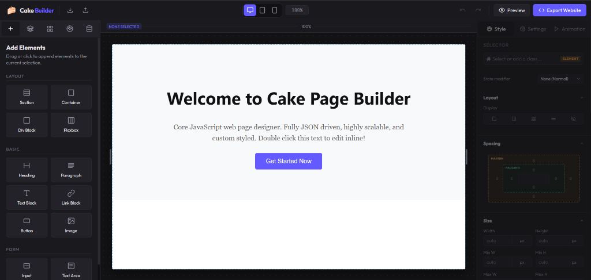

# 🍰 Cake Page Builder

A high-performance, visual, JSON-driven web page builder and designer built entirely in vanilla JavaScript and CSS. Design beautiful web layouts, bind dynamic data structures, configure transitions or pseudo-state style sheets, and export clean, production-ready code instantly.



---

## ✨ Key Features

- **🎨 No-Framework Visual Editor**: Zero third-party runtime frameworks (React/Vue/etc.). Built completely on core Web APIs for lightning-fast loads.
- **📦 Clean JSON State Model**: The entire document tree, class styling sheets, global swatches, and dynamic bindings are driven by a single unified, serializable JSON schema.
- **⚡ Real-Time Responsive Styling**: Visual spacing, layout, size, typography, borders, and backdrop controls targeting customizable viewports (`desktop`, `tablet`, `mobile`).
- **🔗 Contextual Attributes**: Context-aware property inspectors for image file uploads/URLs, hyperlinks targets, and forms input fields.
- **🎛️ Dynamic Data Bindings**: Map components to nested loops (`loopSource`) or text templates (`{{path.to.data}}`) that update in real time on the canvas.
- **📂 One-Click Code Exporter**: Download self-contained HTML/CSS files, or compile a complete project ZIP containing modular stylesheets and base64-extracted asset images.
- **🔌 Highly Extensible Plugin Interface**: Equip the builder core with lifecycle hooks and slot registration engines (`topbar`, `sidebar`, `canvas overlays`).

---

## 📂 Project Architecture

```bash
cake-web-builder/
├── index.html                  # Main Editor Shell Layout & Elements Panel
├── app.css                     # Developer Interface & Workspace Editor Styling
├── package.json                # Project configurations & dependency engines
├── test-data.json              # Mock database source for dynamic bindings evaluation
├── assets/
│   └── images/
│       ├── builder/            # Screenshot assets for documentation
│       └── canvas/             # Canvas placeholders & graphic templates
└── js/
    ├── app.js                  # App controller, keyboard shortcuts, modal hooks
    ├── state.js                # State Manager, history (undo/redo), JSON CRUD engine
    ├── canvas.js               # Canvas frame renderer, drag & drop, outline overlays
    ├── exporter.js             # ZIP / single-file fallback production compiler
    ├── panels/
    │   ├── elements.js         # Leftbar Add Elements list & Navigator layers tree
    │   ├── styles.js           # Rightbar CSS property inspectors (Spacing, Layout, etc.)
    │   ├── attributes.js       # Rightbar specific attributes & custom option rows
    │   ├── theme.js            # Theme panel for global fonts and colors swatches
    │   └── animations.js       # Transitions engine and pseudo-state triggers
    └── plugins/
        ├── animation-plugin.js       # Extends elements with entrance animations
        ├── hover-overlays-plugin.js  # Embeds interactive visual markers on hover
        ├── dynamic-data-plugin.js    # Binds canvas nodes to custom data scopes
        ├── component-builder-plugin.js# Saves selected nodes as reusable components
        └── exporter-plugin.js        # Integrates export commands with the main topbar
```

---

## 🛠️ Installation & Getting Started

### Prerequisites
Make sure you have [Node.js](https://nodejs.org/) installed to run the local server.

### 1. Clone the Repository
```bash
git clone https://github.com/muhammedsaadi99/cake-web-builder.git
cd cake-web-builder
```

### 2. Launch Developer Mode
Spin up the lightweight local server using `http-server` (configured on port `3000` with disabled caching):
```bash
npm run dev
```

### 3. Open in Browser
Visit [http://localhost:3000](http://localhost:3000) in your web browser.

---

## 📄 CWB-JSON State Schema

Cake Page Builder structures web designs using a unified serializable state object:

```json
{
  "version": "1.0",
  "globals": {
    "colors": [
      { "id": "color-primary", "name": "Primary Color", "value": "#635bff" }
    ],
    "fonts": [
      { "id": "font-primary", "name": "Primary Font", "value": "system-ui, sans-serif" }
    ]
  },
  "dynamicData": {},
  "classes": {
    "w-container": {
      "desktop": {
        "max-width": "1200px",
        "margin-left": "auto",
        "margin-right": "auto"
      }
    }
  },
  "tree": {
    "id": "root",
    "tag": "div",
    "classes": ["body-root"],
    "styles": {
      "desktop": {
        "min-height": "100vh",
        "background-color": "#ffffff"
      }
    },
    "children": []
  }
}
```

### Node Interface Definition

| Property | Type | Description |
| :--- | :--- | :--- |
| `id` | `string` | Unique generated string representing the node. |
| `tag` | `string` | HTML tag type (e.g., `div`, `section`, `h1`, `p`, `button`, `input`). |
| `textContent` | `string` | Inner text string (supports template brackets like `{{user.name}}`). |
| `classes` | `array` | List of style class tokens applied to this element. |
| `attributes` | `object` | Key-value pairs for native HTML properties (e.g., `src`, `href`, `placeholder`). |
| `styles` | `object` | Breakpoint-specific style definitions (`desktop`, `tablet`, `mobile`). |
| `children` | `array` | Recursive collection of child nodes nested within this element. |
| `bindings` | `object` | Maps element fields (`textContent` or attributes) to dynamic JSON data paths. |
| `loopSource` | `string` | Path to array in dynamic data for duplicate child list generation. |

---

## 🔌 Extensible Plugin Engine

You can extend the builder's capabilities by writing plugins that register on the global `StateManager`.

### Writing a Simple Plugin
```javascript
export class ConsoleLoggerPlugin {
  constructor() {
    this.id = 'console-logger-plugin';
  }

  install(stateManager) {
    // Listen to changes in the visual tree
    stateManager.on('change', (doc) => {
      console.log('Document state changed:', doc);
    });

    // Listen to selection modifications
    stateManager.on('selectionChange', (selectedId) => {
      console.log('Selected Element Changed:', selectedId);
    });
  }
}
```

### Registering the Plugin
Inside `js/app.js`:
```javascript
import { ConsoleLoggerPlugin } from './plugins/console-logger-plugin.js';
state.registerPlugin(new ConsoleLoggerPlugin());
```

---

## 🤝 Contributing

We welcome contributions to Cake Page Builder! Feel free to:
1. Fork this repository.
2. Create your feature branch (`git checkout -b feature/awesome-feature`).
3. Commit your changes (`git commit -m 'Add awesome feature'`).
4. Push to the branch (`git push origin feature/awesome-feature`).
5. Open a Pull Request.

---

## 📝 License

Distributed under the MIT License. See `LICENSE` for more information.
